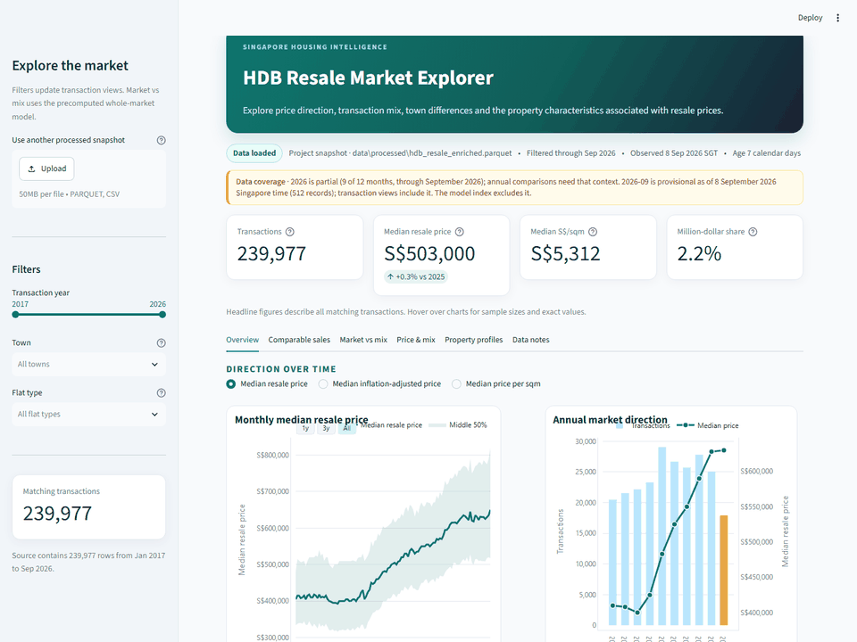
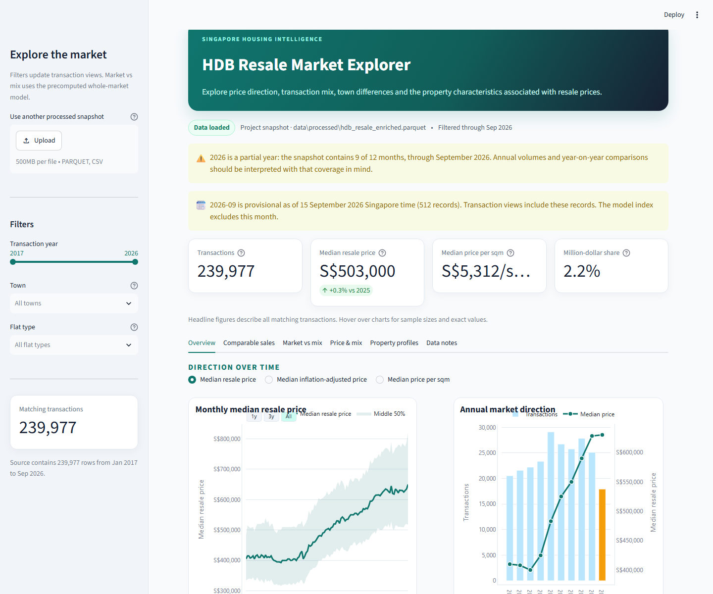
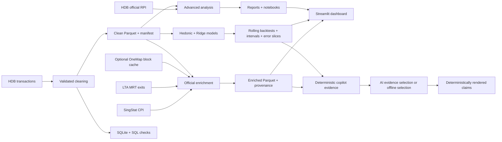

# Singapore HDB Resale Market Analytics

[](https://github.com/Aiden812/singapore-hdb-resale-analytics/actions/workflows/tests.yml)
[](LICENSE)
[](https://singapore-hdb-resale-analytics-aof7acp9fd7ackqqxmmi5w.streamlit.app/)

**For HDB buyers and market analysts who need to separate genuine market movement
from changes in the mix of flats sold.** Headline resale prices can be misleading
when flat size, town, storey, age and an incomplete latest month are not handled
carefully.

## What I built

I built the full analytics workflow: validated ingestion of official Singapore
data, reproducible Parquet and SQLite outputs, nominal and inflation-adjusted
analysis, a quality-adjusted market index, chronological model evaluation, and a
six-tab Streamlit app with transparent comparable-sales fallbacks. A separate
HDB Resale Decision Copilot now turns deterministic evidence into plain-language
answers with structured AI evidence selection, deterministic claim rendering,
prompt-injection defenses and an offline fallback. Provenance checks, automation,
documentation and 147 automated tests make the result auditable and refreshable
rather than a one-off notebook or a thin chatbot wrapper.

## Three main findings

| Finding | Evidence from the current snapshot |
| --- | --- |
| Resale prices rose substantially across complete years | The annual median increased from **S$410,000 in 2017 to S$628,000 in 2025 (+53.2%)**. |
| Transaction mix does not explain away the long-run increase | From Jan 2017 to Aug 2026, the raw monthly median index rose **56.8%** and the quality-adjusted index rose **56.6%**. |
| A time-aware model materially beats a strong recent-market baseline | On Sep 2025-Aug 2026, Ridge achieved **S$52,844 MAE**, a **35.5% improvement** over the prior-12-month town x flat-type baseline. |

These are market-level results, not unit valuations; September 2026 is provisional
and excluded from the model and price index.

## Try the project

[**Open the live dashboard**](https://singapore-hdb-resale-analytics-aof7acp9fd7ackqqxmmi5w.streamlit.app/)
&nbsp;|&nbsp; [**Watch the dashboard walkthrough**](images/dashboard_demo.gif)
&nbsp;|&nbsp; [**Read the copilot design**](docs/copilot.md)
&nbsp;|&nbsp; [**Read the complete analysis report**](docs/analysis_report.md)

**Stack:** Python 3.12 · pandas · scikit-learn · Plotly · Streamlit · Parquet ·
SQLite/SQL · OpenAI Responses API · Pydantic · Jupyter · GitHub Actions



## Why this is more than basic EDA

- **Reproducible data contract:** schema, numeric, date, lease and business-rule
  validation live in `src/clean_data.py`, not only in a notebook.
- **Auditable snapshots:** compressed Parquet outputs are paired with provenance,
  row counts, coverage statistics and SHA-256 hashes.
- **Official-data enrichment:** exact-month SingStat CPI values support real-price
  analysis; LTA MRT exits are validated separately, with OneMap block geocoding
  remaining opt-in rather than inferred.
- **Careful time handling:** year-to-date results are labelled and the incomplete
  source month is excluded from the model and price index.
- **Quality-adjusted analysis:** an unpenalised hedonic fixed-effects model
  estimates the market index; a separate Ridge model handles prediction.
- **Serious validation:** four non-overlapping 12-month expanding-window folds,
  stronger segment baselines, error slices and empirical interval diagnostics
  expose where the model succeeds and fails.
- **Cross-tool reconciliation:** annual medians calculated in Python are checked
  against indexed SQLite queries within a stated tolerance.
- **Portfolio interface:** six dashboard tabs include nominal/real trends, the
  official RPI benchmark, market profiles, an MRT reference map and a
  comparable-sales workflow with explicit fallback logic and CSV export.
- **Grounded AI layer:** deterministic analytics run before the model; accepted
  numeric surfaces are checked against cited evidence records and recognized
  units, and any failed check falls back to a deterministic summary.
- **Engineering safeguards:** 147 automated tests, real-data app smoke tests,
  linting, Python 3.12 CI, bounded HTTP retries, and monthly plus manual refresh
  automation protect the project.

## Current snapshot: key results

The transaction snapshot was observed on **8 September 2026** and contains
**239,977** registrations from January 2017 onward. Its 512 September records
are provisional, so the model and market index stop at August 2026. CPI was
available through July 2026 and was joined only by exact month—never
forward-filled.

| Result | Current snapshot | Interpretation guardrail |
| --- | ---: | --- |
| Raw median-price index change, Jan 2017–Aug 2026 | **+56.8%** | Changes with the mix of flats sold |
| Quality-adjusted model index change | **+56.6%** | Conditional on included recorded attributes |
| Raw-minus-adjusted change | **0.2 pp** | Similar cumulative movement does not rule out monthly composition effects |
| CPI-adjusted raw median change, Jan 2017–Jul 2026 | **+28.9% real** | Nominal change was +55.6%; CPI is not a housing-specific deflator |
| Latest 12-month Ridge MAE | **S$52,844** | Sep 2025–Aug 2026; market model, not a unit valuation |
| Improvement vs prior-12m town × flat-type baseline | **35.5%** | Stronger baseline MAE: S$81,890 |
| Four-fold mean Ridge MAE | **S$52,347** | Prior-12m segment baseline: S$79,287 |
| Empirical interval coverage | **70.7% mean / 75.0% latest** | Below the 80% target; latest median width S$148,136 |

Additional robustness results:

- CPI matched 236,944 of 239,977 rows (98.74%); August and September 2026
  real-price values remain missing because official CPI had not been published.
- Toa Payoh leads the guarded 2017–2025 raw-median town comparison at 76.4%,
  with 749 and 1,063 endpoint transactions.
- Removing 318 fully identical rows changes the overall median by S$0.00. They
  remain because the public data has no transaction or unit ID proving error.
- Python and SQLite annual medians agree for every compared year within S$0.01.
- The official LTA layer contributes 541 validated MRT exits across 147 station
  names; all LRT features are excluded.

See the [complete analysis report](docs/analysis_report.md),
[model card](docs/model_card.md),
[data dictionary](docs/data_dictionary.md) and
[advanced analysis report](reports/advanced_analysis_report.md) for the complete
methodology and caveats.

## Dashboard
[**Open the live dashboard**](https://singapore-hdb-resale-analytics-aof7acp9fd7ackqqxmmi5w.streamlit.app/)

Run the interactive application locally:

```powershell
streamlit run app.py
```

The app prefers the tracked, provenance-verified enriched Parquet snapshot and
falls back to the clean Parquet, a local clean CSV, or a user upload. It displays
model artifacts only when their recorded hashes match the loaded source
snapshot.

For a checksum-verified project snapshot, the source strip shows its official
observation date in Singapore time and nonnegative calendar-day age. The app
warns when that age exceeds 45 days. User uploads do not receive an
authoritative freshness label.

Its six tabs cover:

1. Market overview and nominal or CPI-adjusted trends
2. Comparable sales with transparent four-level widening rules
3. Raw median prices against the official HDB RPI
4. Price, transaction-volume and flat-mix analysis
5. Property profiles and the official MRT-exit reference map
6. Data provenance, model diagnostics and interpretation notes

Comparable sales are observed transactions, not a formal valuation. Thin
samples are flagged, each fallback is explained, and both a 250-row preview and
the full matched set can be downloaded.



The public app runs on Streamlit Community Cloud from `app.py`. Every push to
`main` is detected automatically; dependency changes trigger a full rebuild and
ordinary code changes are reflected in the app shortly after GitHub updates.

## HDB Resale Decision Copilot

The standalone `copilot_app.py` adds a narrow AI product to the same verified
analytics pipeline without changing the public dashboard. Its four structured
modes cover market briefs, comparable sales, town comparisons and model
reliability. Filters select a deterministic calculation; the optional question
can change only which verified evidence records are prioritised.

```powershell
# OPENAI_API_KEY is optional; without it the same evidence renders offline.
$env:OPENAI_API_KEY = "your-key"
streamlit run copilot_app.py
```

The model receives a compact evidence packet—not the full transaction dataset.
Responses use a strict Pydantic schema, `store=False` and a session request cap.
The model-written draft is never displayed: only its validated evidence-ID
selection survives, and project code reconstructs every visible claim from the
cited record. Unknown citations, unsupported numbers and tested prohibited
phrasing also trigger fallback. If credentials, network access or validation are
unavailable, the app uses deterministic evidence selection too. Market and town
comparisons require at least 20 matching transactions; the comparable-sales mode
exposes its selected minimum and any widening. Inspectable fact IDs, source links,
sample sizes,
checksum-verified snapshot coverage and caveats remain visible in both paths.

See the [copilot architecture, setup and limits](docs/copilot.md) and the frozen
[evaluation cases](evals/copilot_cases.json). The current Ridge artifact remains
a market-monitoring model: the copilot deliberately does not estimate a unit's
value because its empirical ranges under-cover the documented target.

## Analysis architecture



## Official data sources

- Housing & Development Board,
  [resale flat prices from January 2017 onward](https://data.gov.sg/datasets/d_8b84c4ee58e3cfc0ece0d773c8ca6abc/view),
  dataset `d_8b84c4ee58e3cfc0ece0d773c8ca6abc`.
- Housing & Development Board,
  [HDB Resale Price Index](https://data.gov.sg/datasets/d_14f63e595975691e7c24a27ae4c07c79/view),
  dataset `d_14f63e595975691e7c24a27ae4c07c79`.
- Singapore Department of Statistics,
  [monthly Consumer Price Index](https://data.gov.sg/datasets/d_bdaff844e3ef89d39fceb962ff8f0791/view),
  dataset `d_bdaff844e3ef89d39fceb962ff8f0791`.
- Land Transport Authority,
  [MRT Station Exit GEOJSON](https://data.gov.sg/datasets/d_b39d3a0871985372d7e1637193335da5/view),
  dataset `d_b39d3a0871985372d7e1637193335da5`.
- Singapore Land Authority,
  [OneMap Search API](https://www.onemap.gov.sg/apidocs/search), used only when
  the user supplies a token for block-level coordinates.

The data.gov.sg sources are used under the
[Singapore Open Data Licence](https://data.gov.sg/open-data-licence). Detailed
attribution is in [THIRD_PARTY_NOTICES.md](THIRD_PARTY_NOTICES.md).

## Reproduce the project

### 1. Create the environment

```powershell
python -m venv .venv
.\.venv\Scripts\Activate.ps1
python -m pip install -r requirements.txt
```

`requirements.txt` pins direct runtime dependencies.
`requirements-lock.txt` records the exact transitive environment, while
`requirements-dev.txt` adds notebook and lint tooling.

### 2. Refresh the data and analytical artifacts

```powershell
python src/download_data.py --force
python src/clean_data.py
python src/build_database.py
python src/official_enrichment.py --refresh-cpi --refresh-mrt
python src/advanced_analysis.py --refresh-rpi
python src/model_price.py --input data/processed/hdb_resale_clean.parquet
```

The downloader stages and validates replacements before touching an existing
raw file. Official HTTP calls use bounded exponential backoff, honour
`Retry-After`, and keep API keys away from presigned export URLs. The model uses
the Singapore snapshot timestamp to exclude an open transaction month.

### 3. Rebuild and execute the notebooks

```powershell
python scripts/upgrade_hdb_notebook.py
python scripts/build_portfolio_notebook.py
Push-Location notebooks
jupyter nbconvert --to notebook --execute --inplace hdb_analysis.ipynb --ExecutePreprocessor.timeout=900
jupyter nbconvert --to notebook --execute --inplace portfolio_analysis.ipynb --ExecutePreprocessor.timeout=900
Pop-Location
```

The [EDA notebook](notebooks/hdb_analysis.ipynb) explains cleaning and eight
descriptive questions. The
[portfolio notebook](notebooks/portfolio_analysis.ipynb) leads with the
quality-adjusted result, holdout validation, official RPI benchmark and
robustness checks. Both are committed with executed outputs.

## Optional block-to-MRT proximity

`src/geocode_blocks.py` geocodes unique block-and-street combinations with the
official OneMap Search API. It is opt-in because the current API requires a
token; credentials and the generated cache are never committed.

```powershell
$env:ONEMAP_API_TOKEN = "your-token"
python src/geocode_blocks.py
python src/official_enrichment.py
```

The geocoder is resumable, rate-limited and writes atomically. The enrichment
step then calculates straight-line distance to the nearest verified MRT exit.
See `.env.example` for all supported environment variables.

## Project structure

```text
singapore-hdb-resale-analytics/
├── .github/workflows/       # CI plus monthly/manual snapshot refresh
├── .streamlit/              # deployable app theme and configuration
├── data/
│   ├── raw/                 # large transactions/caches ignored; RPI tracked
│   └── processed/           # clean + enriched Parquet and provenance
├── database/                # generated SQLite database, kept local
├── docs/                    # data dictionary and model card
├── evals/                   # frozen copilot quality and safety cases
├── images/                  # charts and dashboard walkthrough
├── notebooks/               # executed EDA and portfolio notebooks
├── reports/                 # tables, metrics, backtests and provenance
├── scripts/                 # reproducible notebook builders
├── sql/analysis_queries.sql
├── src/
│   ├── advanced_analysis.py
│   ├── build_database.py
│   ├── clean_data.py
│   ├── dashboard_data.py
│   ├── download_data.py
│   ├── geocode_blocks.py
│   ├── http_retry.py
│   ├── model_price.py
│   ├── copilot.py
│   ├── copilot_tools.py
│   └── official_enrichment.py
├── tests/
├── app.py
├── copilot_app.py
├── LICENSE
├── THIRD_PARTY_NOTICES.md
├── pyproject.toml
├── requirements.txt
└── requirements-lock.txt
```

Large raw files, clean CSV, SQLite database, virtual environment, secrets and
source caches are ignored. Compact clean and enriched Parquet snapshots are
tracked so a fresh clone can open the reviewed dashboard immediately.

## Tests and automation

```powershell
python -m pip check
python -m ruff check .
python -m unittest discover -s tests -v
python scripts/evaluate_copilot.py
```

All **147 tests** currently pass. Coverage includes cleaning contracts, lease
parsing, duplicate policy, safe downloads and retries, SQL indexes and
reconciliation, RPI normalisation, CPI joins, MRT/LRT validation, time-based
splits, stronger model baselines, interval diagnostics, error slices,
comparable-sales fallbacks and exports, notebook execution, report hashes and a
real Streamlit render. Copilot coverage adds exact evidence calculations,
deterministic comparable ranking, structured-response mocks, citation and
number-and-unit grounding, injection and prohibited-claim failures, no-key/API
fallbacks, a 40-case evaluator that runs each case's inputs through the tracked
snapshot and real evidence builders, mutation tests proving declared evaluator
policies fail when tampered with, and offline Streamlit submissions across all
four modes.

GitHub Actions runs checks on Python 3.12. The separate **Refresh analysis
snapshot** workflow runs monthly in `Asia/Singapore` and on manual dispatch. It
rebuilds every artifact and uploads a review bundle; it never silently commits
new data.

## Interpretation limits

- Results describe registered transactions; they do not identify causal
  premiums, predict future prices or value a specific unit.
- The hedonic index is not a repeat-sales index and is not interchangeable with
  the official HDB RPI.
- CPI adjustment expresses general purchasing power, not housing affordability,
  and the official series currently ends in July 2026.
- MRT exits are verified, but transaction-level distances remain unavailable
  until a verified OneMap block cache is supplied. The LTA layer describes
  current infrastructure and can include stations not yet in passenger service;
  it is not a historical-accessibility dataset.
- Empirical price ranges under-cover their nominal 80% target and are not
  guaranteed confidence intervals.
- Renovation quality, exact unit floor, view and other unobserved features can
  materially affect price.
- Year-to-date figures and the latest source month must be read with their
  explicit coverage labels.

## Licence

The project code and documentation are available under the
[MIT License](LICENSE). Third-party datasets remain subject to their source
terms; see [THIRD_PARTY_NOTICES.md](THIRD_PARTY_NOTICES.md).

An optional Power BI guide remains in `powerbi/`, but the implemented portfolio
does not depend on Power BI.
