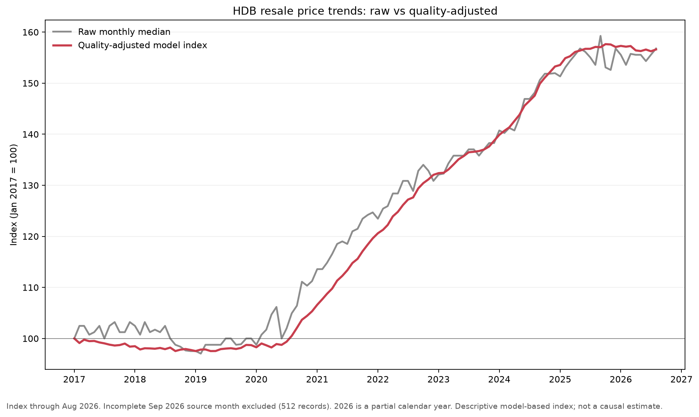
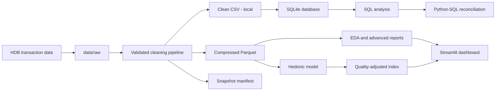

# Singapore HDB Resale Market Analytics

[](https://github.com/Aiden812/singapore-hdb-resale-analytics/actions/workflows/tests.yml)

A reproducible market-monitoring project for Singapore HDB resale transactions.
It combines a validated Python pipeline, Parquet snapshot, SQLite/SQL checks,
decision-oriented notebooks, a quality-adjusted price model and an interactive
Streamlit dashboard.



## What makes this more than basic EDA

- **Reproducible data contract:** schema, numeric, date, lease and business-rule
  validation live in `src/clean_data.py` rather than only in a notebook.
- **Auditable snapshot:** the compressed Parquet file is paired with a manifest
  containing hashes, coverage, column names and duplicate counts.
- **Careful time handling:** year-to-date results are labelled, and the current
  incomplete month is excluded from the model and price index.
- **Quality-adjusted analysis:** an unpenalised hedonic fixed-effects model
  estimates the index; a separate Ridge model handles holdout prediction.
- **Out-of-time evaluation:** the latest 12 complete months form a chronological
  holdout; preprocessing is fitted only on earlier transactions.
- **Cross-tool reconciliation:** annual medians calculated in Python are checked
  against SQLite queries within a stated tolerance.
- **Portfolio interface:** a five-tab Streamlit app includes filters, sample-size
  warnings, distributions, market profiles and the raw-versus-adjusted result.
- **Engineering safeguards:** unit tests, a real-data app smoke test, linting,
  CI on Python 3.11/3.12 and a manual refresh workflow protect the project.

## Current snapshot: key results

These results use the source snapshot observed on **8 September 2026**. September
contains only 512 provisional records, so the model and monthly index stop at
August 2026. Descriptive year-to-date tables retain those records and label the
coverage explicitly.

| Result | Current snapshot | Interpretation guardrail |
| --- | ---: | --- |
| Raw median-price index change, Jan 2017–Aug 2026 | **+56.8%** | Changes with the mix of flats sold |
| Quality-adjusted model index change | **+56.6%** | Uses unpenalised month effects; conditional on included variables |
| Raw-minus-adjusted change | **0.2 pp** | Cumulative raw and adjusted movements are nearly identical in this specification |
| Chronological holdout MAE | **S$52,844** | Market-level model; not an individual valuation |
| Chronological holdout R² | **0.893** | Evaluated on Sep 2025–Aug 2026 |
| MAE improvement over training-median baseline | **74.4%** | Baseline is intentionally simple and transparent |

Additional robustness results:

- Toa Payoh leads the guarded 2017–2025 raw-median town comparison at 76.4%,
  with 749 and 1,063 endpoint records.
- Removing 318 fully identical rows changes the overall median by S$0.00; they
  remain in the canonical data because there is no transaction or unit ID that
  proves they are erroneous.
- Python and SQLite annual medians match for every compared year within S$0.01.
- The raw quarterly median is benchmarked against the official HDB Resale Price
  Index (RPI), with both series clearly labelled as methodologically different.

Read the [model card](docs/model_card.md) and
[advanced analysis report](reports/advanced_analysis_report.md) for the full
methodology and caveats.

## Dashboard

Run the interactive app locally:

```powershell
streamlit run app.py
```

The app prefers the tracked compressed Parquet snapshot, falls back to a local
clean CSV and also accepts a processed CSV or Parquet upload. Model artifacts
are displayed only when their input and output SHA-256 hashes match the loaded
snapshot.

The repository is ready for Streamlit Community Cloud deployment: choose
`app.py` as the entry point and keep `requirements.txt` at the repository root.
See the [official deployment guide](https://docs.streamlit.io/deploy/streamlit-community-cloud/deploy-your-app/deploy).

## Analysis architecture



## Data sources

- Housing & Development Board,
  [Resale flat prices based on registration date from Jan 2017 onwards](https://data.gov.sg/datasets/d_8b84c4ee58e3cfc0ece0d773c8ca6abc/view),
  dataset `d_8b84c4ee58e3cfc0ece0d773c8ca6abc`.
- Housing & Development Board,
  [HDB Resale Price Index](https://data.gov.sg/datasets/d_14f63e595975691e7c24a27ae4c07c79/view),
  dataset `d_14f63e595975691e7c24a27ae4c07c79`.

The source notes that transaction prices are indicative and depend on many
property characteristics. Some transactions that may not reflect full market
value are excluded by the publisher.

## Reproduce the project

### 1. Create the environment

```powershell
python -m venv .venv
.\.venv\Scripts\Activate.ps1
python -m pip install -r requirements.txt
```

`requirements.txt` contains the direct pinned dependencies. Use
`requirements-lock.txt` when exact transitive versions are required, or
`requirements-dev.txt` for development and linting.

### 2. Refresh the data and analytical artifacts

```powershell
python src/download_data.py
python src/clean_data.py
python src/build_database.py
python src/advanced_analysis.py --download-rpi
python src/model_price.py --input data/processed/hdb_resale_clean.parquet
```

The downloader protects an existing raw file unless `--force` is supplied. The
model reads the matching snapshot manifest to determine the Singapore as-of
month and excludes a still-open calendar month. Use `--as-of YYYY-MM-DD` only
when an explicit historical cutoff is needed.

### 3. Rebuild and execute the notebooks

```powershell
python scripts/upgrade_hdb_notebook.py
python scripts/build_portfolio_notebook.py
Push-Location notebooks
jupyter nbconvert --to notebook --execute --inplace hdb_analysis.ipynb --ExecutePreprocessor.timeout=900
jupyter nbconvert --to notebook --execute --inplace portfolio_analysis.ipynb --ExecutePreprocessor.timeout=900
Pop-Location
```

The [main EDA notebook](notebooks/hdb_analysis.ipynb) explains the cleaning and
eight descriptive questions. The
[portfolio notebook](notebooks/portfolio_analysis.ipynb) leads with the
quality-adjusted result, holdout validation, official RPI benchmark and
robustness checks. Both are stored with executed outputs.

## Optional OneMap geocoding

`src/geocode_blocks.py` can enrich unique block-and-street combinations with
coordinates using the official [OneMap Search API](https://www.onemap.gov.sg/apidocs/search).
The current API requires a token, so no credentials or generated location cache
are committed.

```powershell
$env:ONEMAP_API_TOKEN = "your-token"
python src/geocode_blocks.py --limit 100
```

The process is resumable, rate-limited and writes atomically. See `.env.example`
for supported environment variables.

## Project structure

```text
singapore-hdb-resale-analytics/
├── .github/workflows/       # CI and manual snapshot refresh
├── .streamlit/              # deployable app theme/configuration
├── data/
│   ├── raw/                 # transaction CSV ignored; small RPI snapshot tracked
│   └── processed/           # tracked Parquet + manifest; clean CSV ignored
├── database/                # generated SQLite database, kept local
├── docs/
│   ├── data_dictionary.md
│   └── model_card.md
├── images/                  # exported, reviewable charts
├── notebooks/
│   ├── hdb_analysis.ipynb
│   └── portfolio_analysis.ipynb
├── reports/                 # machine-readable tables, metrics and narrative
├── scripts/                 # reproducible notebook builders/updaters
├── sql/analysis_queries.sql
├── src/
│   ├── advanced_analysis.py
│   ├── build_database.py
│   ├── clean_data.py
│   ├── dashboard_data.py
│   ├── download_data.py
│   ├── geocode_blocks.py
│   └── model_price.py
├── tests/                   # pipeline, SQL, model, dashboard and artifact tests
├── app.py
├── pyproject.toml
├── requirements.txt
└── requirements-lock.txt
```

The raw transaction CSV, clean CSV, SQLite database, virtual environment,
secrets and caches are ignored. The compact Parquet snapshot and its manifest
are tracked so a fresh clone can open the dashboard and reproduce the reviewed
snapshot immediately.

## Tests and automation

```powershell
python -m pip check
python -m ruff check .
python -m unittest discover -s tests -v
```

The test suite covers cleaning rules, lease parsing, duplicate policy, download
validation, SQL execution and indexes, RPI normalisation, chronological splits,
model determinism, provisional-month handling, report hashes, notebook
execution and a real Streamlit render.

GitHub Actions runs the checks on Python 3.11 and 3.12. The separate **Refresh
analysis snapshot** workflow downloads current data, rebuilds every artifact,
executes both notebooks and uploads a review bundle; it does not silently commit
new data.

## Interpretation limits

- Results describe registered resale transactions; they do not identify causal
  premiums or forecast a specific unit's price.
- The hedonic index is not a repeat-sales index and is not interchangeable with
  the official HDB RPI.
- Renovation quality, exact unit floor, view, transport proximity and other
  unobserved features can affect prices.
- Year-to-date figures and the latest source month must be read with their
  explicit coverage labels.
- Geospatial enrichment remains optional until a OneMap token is supplied.

An optional Power BI build guide remains in `powerbi/`, but the implemented
portfolio does not depend on Power BI.
