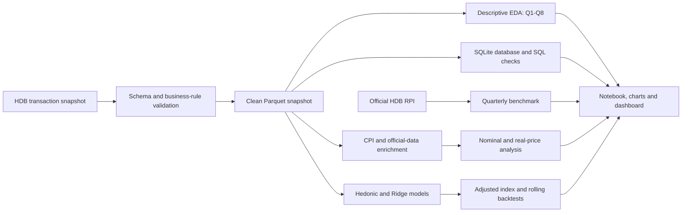
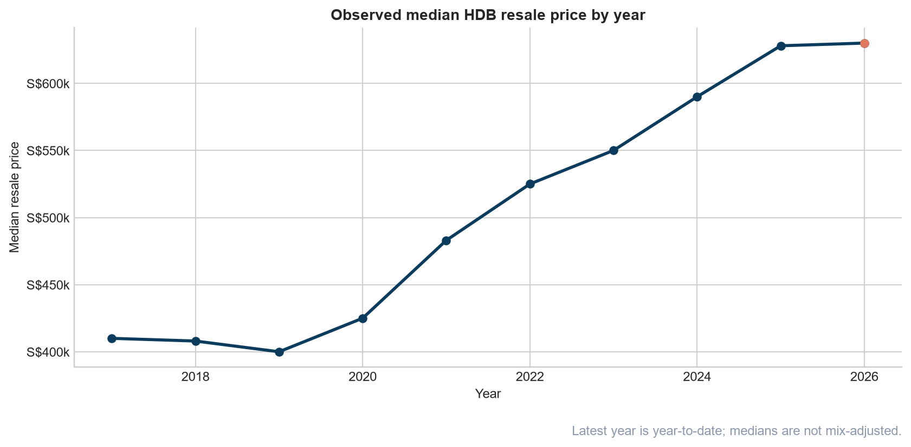
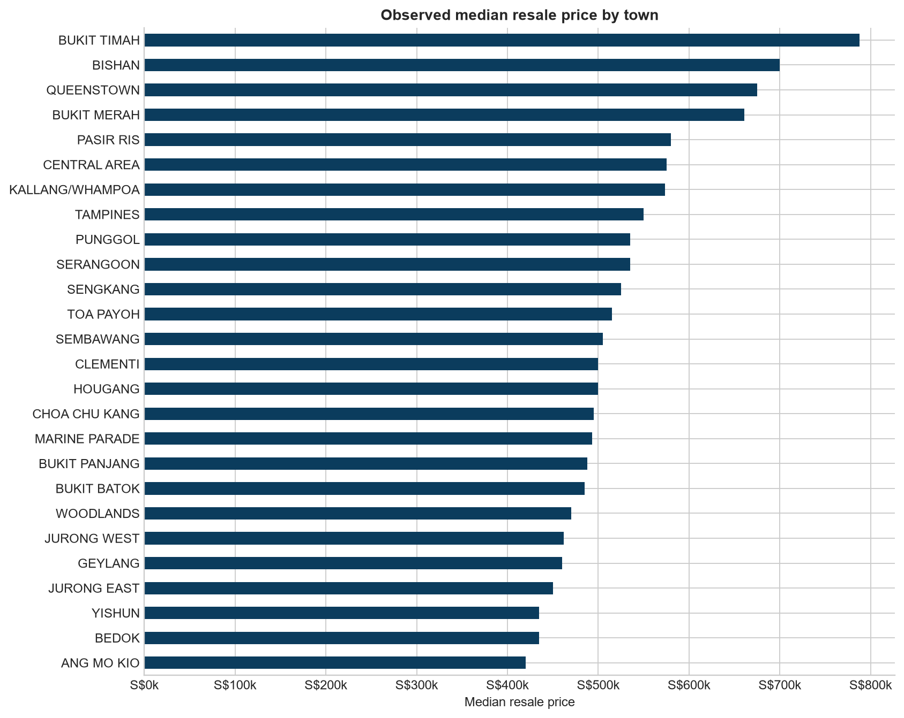
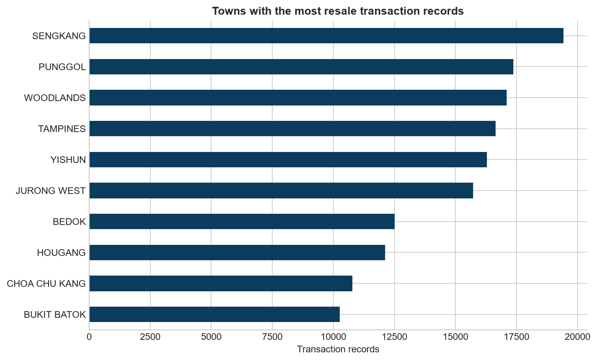
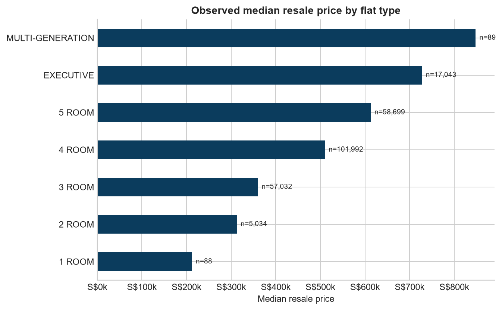
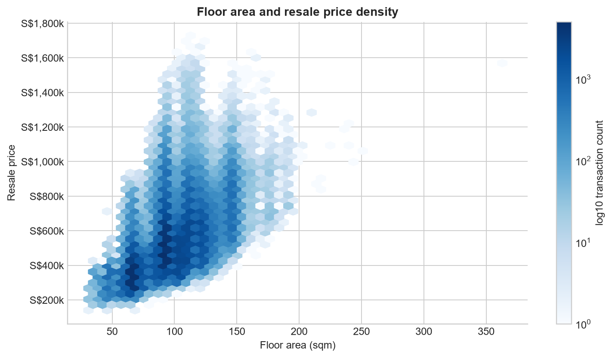
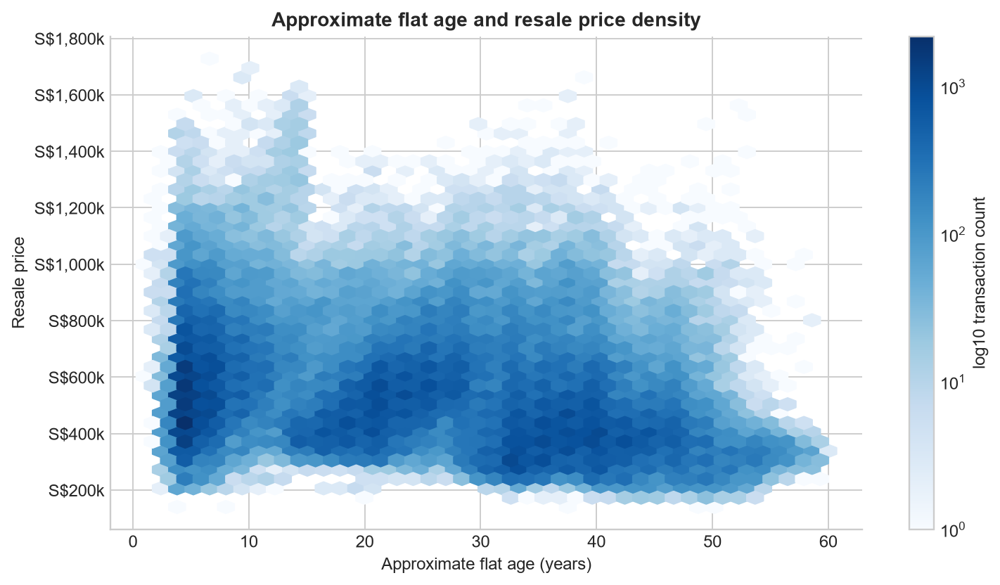
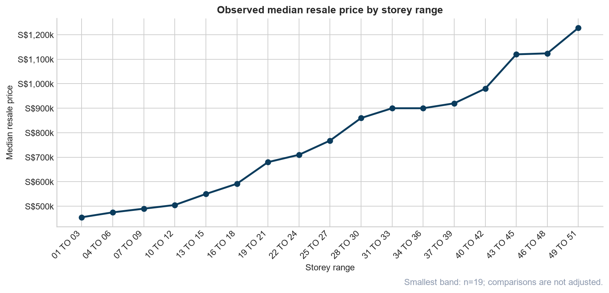
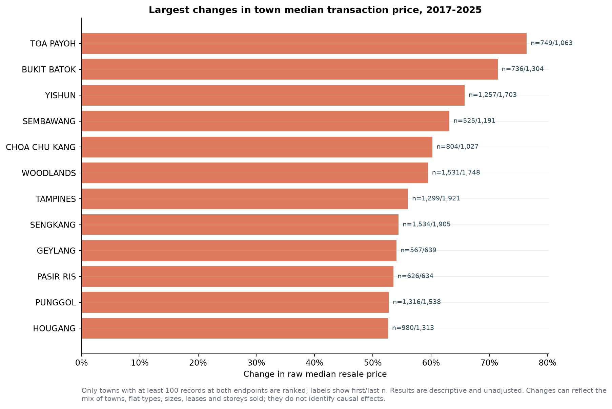
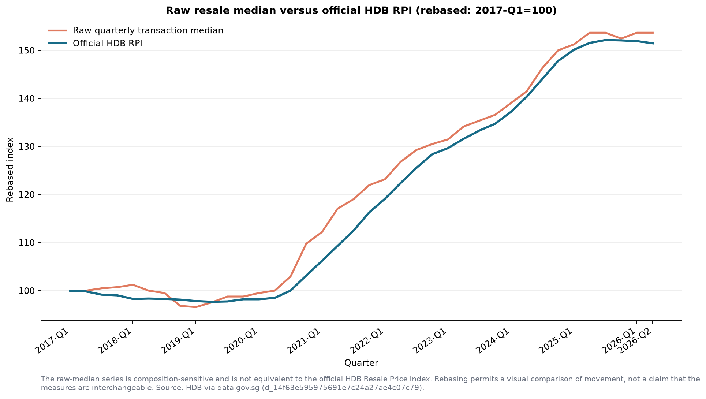

# Singapore HDB Resale Market Analysis

## Executive summary

This report analyses registered Singapore HDB resale transactions from January
2017 onward. The current transaction snapshot was observed on **8 September
2026** and contains **239,977 records** through September 2026. Because the 512
September records cover only part of that month, annual descriptive results for
2026 are labelled year-to-date, while the price model and adjusted index stop at
August 2026.

The central finding is that resale prices rose substantially over the study
period. Across complete calendar years, the observed annual median increased
from **S$410,000 in 2017 to S$628,000 in 2025**, a **53.2% increase**. On a
monthly basis, the raw median-price index increased **56.8%** from January 2017
to August 2026. A hedonic index that adjusts for recorded transaction mix rose
**56.6%** over the same months. The small **0.2 percentage-point** cumulative
gap suggests similar market-wide movement under this specification, but it
does not rule out meaningful composition effects in individual months or
segments.

Inflation changes the scale, not the direction, of that result. From January
2017 to July 2026, the raw monthly median rose **55.6% in nominal terms** and
**28.9% after adjustment with Singapore's all-items CPI**. CPI is a general
purchasing-power deflator rather than a housing-affordability index, so this
real-price series answers a narrower question: how resale prices moved relative
to the general price level.

The predictive model also performs materially better than time-aware
benchmarks. On the latest untouched 12-month holdout, its mean absolute error
was **S$52,844**, a **35.5% improvement** over a prior-12-month town-by-flat-type
median baseline. Its empirical uncertainty ranges should nevertheless be read
carefully: latest-fold coverage was **75.0%**, below the stated 80% target.

| Headline result | Verified value | Interpretation |
| --- | ---: | --- |
| Records in the snapshot | 239,977 | Registered transactions, not unique flats |
| Overall median transaction price | S$503,000 | Mix-sensitive summary across the full period |
| Overall average transaction price | S$534,702 | Pulled upward by higher-priced transactions |
| Overall median price per sqm | S$5,312.50 | Useful for size-normalised comparison, not a valuation |
| Complete-year median change, 2017–2025 | +53.2% | S$410,000 to S$628,000 |
| Raw monthly index change, Jan 2017–Aug 2026 | +56.8% | Mix-sensitive |
| Quality-adjusted index change, Jan 2017–Aug 2026 | +56.6% | Conditional on recorded attributes |
| Latest 12-month Ridge MAE | S$52,844 | Market model; not a unit appraisal |

The figures above are recorded in the executed
[EDA notebook](../notebooks/hdb_analysis.ipynb), the
[snapshot manifest](../data/processed/snapshot_metadata.json), and the
[model metrics](../reports/price_model_metrics.json).

## Data and analytical method

### Sources and coverage

The analysis combines four official public-data layers:

- HDB resale registrations from data.gov.sg, dataset
  `d_8b84c4ee58e3cfc0ece0d773c8ca6abc`.
- The official HDB Resale Price Index (RPI), dataset
  `d_14f63e595975691e7c24a27ae4c07c79`.
- Singapore Department of Statistics monthly all-items CPI, dataset
  `d_bdaff844e3ef89d39fceb962ff8f0791`.
- Land Transport Authority MRT station exits, dataset
  `d_b39d3a0871985372d7e1637193335da5`.

The clean transaction table has **17 columns**: 11 source fields and six
engineered fields. Its coverage runs from **2017-01 to 2026-09**. The processed
Parquet file is paired with a SHA-256 hash, row count, column list, source date,
and source hash in the snapshot manifest. This makes the analysis traceable to
one reviewed data state rather than to an unspecified live download.

### Pipeline



### Cleaning and feature engineering

The cleaning work is implemented in Python rather than existing only as manual
notebook steps. It:

- validates the required schema and rejects invalid date, numeric, lease, and
  business-rule values;
- parses `month` as a date and derives `year` and `month_number`;
- converts resale price, floor area, and lease commencement year to numeric
  values;
- creates `price_per_sqm`, approximate `flat_age`, storey-band midpoint
  `storey_mid`, and month-level `remaining_lease_months`;
- strips leading and trailing whitespace from categorical text fields; and
- writes a reproducible clean snapshot plus provenance metadata.

The source contains **318 fully identical rows**. They are retained because the
public data contains neither a transaction ID nor a unit number that could prove
they are erroneous duplicates. As a sensitivity check, removing them changes
the overall median by **S$0.00**; the same annual median is retained in each
reported year. See the
[duplicate-sensitivity table](../reports/duplicate_sensitivity.csv) and the
[data dictionary](data_dictionary.md).

## The eight analytical questions

The first seven answers describe the observed mix of transactions over the full
snapshot. They are not adjusted estimates of standalone property premiums. The
eighth uses complete calendar years and an endpoint sample guard.

### Q1. How have HDB resale prices changed over time?

The observed annual median fell from **S$410,000 in 2017** to **S$400,000 in
2019**, then increased to **S$628,000 in 2025**. The complete-year change from
2017 to 2025 was **53.2%**. The 2026 median is **S$630,000**, but this is a
year-to-date result covering nine month labels and must not be treated as a
full-year comparison.



The latest period also shows a wider price distribution. In partial-year 2026,
the observed 25th percentile, median, 75th percentile, and 90th percentile were
**S$515,000, S$630,000, S$780,000, and S$950,000**, respectively. These values
come from the tracked
[annual distribution table](../reports/annual_price_quantiles.csv).

### Q2. Which towns have the highest median resale prices?

Across the full snapshot, **Bukit Timah** has the highest observed town median
at **S$787,500**, followed by Bishan at **S$700,000** and Queenstown at
**S$675,000**. Bukit Timah contributes **582 transactions**, far fewer than
several large towns, so its ranking should be interpreted alongside its sample
size and transaction mix.



This is not a location premium estimate. Towns differ in flat type, size,
remaining lease, storey distribution, and transaction timing.

### Q3. Which towns have the most transactions?

**Sengkang** records the most transactions, with **19,423**, followed by Punggol
with **17,371** and Woodlands with **17,097**. Counts represent registrations in
the dataset, not the number of distinct flats, because no persistent unit
identifier is available.



### Q4. How does flat type relate to resale price?

**Multi-Generation** flats have the highest observed flat-type median at
**S$848,000**. This comparison is descriptive: larger flat types generally have
more floor area, while their town, age, and storey mix also differs. The chart
therefore reports sample sizes and should not be interpreted as the isolated
effect of choosing one flat type.



### Q5. How does floor area relate to resale price?

Floor area has a **0.56 Pearson correlation** with resale price in this
snapshot, indicating a moderate positive association. The density plot shows
that price dispersion remains substantial at similar sizes; area alone does not
determine transaction price.



### Q6. How does flat age relate to resale price?

Approximate flat age has a **-0.30 correlation** with resale price. Older flats
tend to appear at lower observed prices in the aggregate, but this does not show
that age independently causes the difference. Construction cohort, location,
flat type, size, storey, and transaction period overlap with age. The model
therefore uses a nonlinear remaining-lease term rather than treating this
correlation as an isolated discount.



### Q7. Do higher-storey flats command higher prices?

Storey midpoint has a **0.34 correlation** with resale price, and observed
medians generally rise across the storey bands. The median is **S$455,000** for
`01 TO 03` and **S$1,228,000** for `49 TO 51`. However, the lowest band contains
**42,116 records**, whereas the highest contains only **19**. The upper-storey
figures are therefore thin-sample descriptive results, not an estimated causal
storey premium.



### Q8. Which towns experienced the greatest median-price growth?

The guarded comparison uses 2017 and 2025, the earliest and latest complete
calendar years, and requires at least 100 transactions in each endpoint year.
**Toa Payoh** ranks first: its median increased from **S$445,000 to S$785,000**,
or **76.4%**, based on **749** and **1,063** endpoint transactions. Bukit Batok
ranked second at **71.4%**, followed by Yishun at **65.8%**.



These are changes in town-level transaction medians, not repeat-sales
appreciation estimates. The public data cannot match the same flat across time,
and a town's mix of transacted flats can change.

## Inflation, the official RPI, and quality adjustment

### Nominal versus CPI-adjusted prices

The CPI enrichment joins transactions to the official all-items CPI by exact
month and never forward-fills unavailable observations. It matches **236,944 of
239,977 transactions (98.74%)**. The CPI series available to the project ends
in **July 2026**, so real-price values for August and September 2026 remain
missing.

With January 2017 rebased to 100, the July 2026 nominal median index is
**155.56** and the CPI-adjusted index is **128.91**. That corresponds to
**+55.6% nominal** and **+28.9% real** movement. The calculation expresses each
transaction in July 2026 Singapore dollars using:

```text
real resale price = nominal resale price × July 2026 CPI ÷ transaction-month CPI
```

The method and coverage are recorded in
[official enrichment metadata](../reports/official_enrichment_metadata.json)
and the [monthly inflation table](../reports/monthly_price_inflation.csv).

### Comparison with the official HDB RPI

The official benchmark covers **2017-Q1 through 2026-Q2**. After both series are
rebased to 100 in 2017-Q1, the official RPI reaches **151.46** in 2026-Q2 while
the raw quarterly median reaches **153.66**, a latest-quarter gap of **2.20
index points**. The two measures broadly move in the same direction, but they
are not interchangeable: the raw median changes with transaction mix, whereas
the official RPI applies HDB's own quality-adjustment methodology.



The underlying values and quarter-coverage flags are available in the
[RPI benchmark table](../reports/quarterly_rpi_benchmark.csv).

### Project quality-adjusted index

The project's hedonic index models the natural logarithm of resale price using
log-quadratic floor area, quadratic remaining lease, quadratic storey midpoint,
town, flat type, flat model, and transaction-month fixed effects. Its month
effects are estimated without regularisation so the published time movement is
not mechanically shrunk by the predictive Ridge penalty.

From January 2017 to August 2026, the raw monthly index increased **56.8%** and
the quality-adjusted index increased **56.6%**. The cumulative difference is
**0.2 percentage points**.


This is a transaction-mix-adjusted trend conditional on recorded attributes.
It is not a repeat-sales index, a causal estimate, or a substitute for the
official HDB RPI. Full specification details are in the
[model card](model_card.md), with monthly values in the
[quality-adjusted index table](../reports/quality_adjusted_price_index.csv).

## Predictive model evaluation

The Ridge model is evaluated separately from the unpenalised index model. The
latest split trains on **214,873 records from January 2017 through August 2025**
and tests on the next **24,592 records from September 2025 through August 2026**.
No holdout record is used to fit the model.

| Latest 12-month holdout | Training median | Town × flat type | Prior-12m town × flat type | Hedonic Ridge |
| --- | ---: | ---: | ---: | ---: |
| MAE | S$206,276 | S$161,755 | S$81,890 | **S$52,844** |
| Median absolute error | S$150,888 | S$135,000 | S$52,000 | **S$41,609** |
| 90th-percentile absolute error | S$462,000 | S$321,000 | S$190,888 | **S$111,584** |
| RMSE | S$274,221 | S$200,896 | S$124,087 | **S$69,635** |
| R² | -0.654 | 0.112 | 0.661 | **0.893** |
| MAPE | 27.55% | 22.63% | 11.92% | **8.23%** |

Relative to the strongest baseline—the prior-12-month town-by-flat-type
median—the Ridge model reduces MAE by **35.5%**. Four non-overlapping,
expanding-window backtests provide a broader check across market periods:

| Four-fold mean | Training median | Town × flat type | Prior-12m town × flat type | Hedonic Ridge |
| --- | ---: | ---: | ---: | ---: |
| MAE | S$185,522 | S$149,805 | S$79,287 | **S$52,347** |
| Median absolute error | S$138,472 | S$128,222 | S$50,889 | **S$42,297** |
| 90th-percentile absolute error | S$416,750 | S$286,972 | S$188,844 | **S$107,902** |

The empirical 10th-to-90th-percentile ranges use a six-month calibration window
inside each training period. Their mean four-fold coverage is **70.7%**, versus
an 80% target. Latest-fold coverage is **75.0%**, and its median range width is
**S$148,136**. This undercoverage is disclosed rather than hidden: the ranges
are model diagnostics and are not guaranteed confidence intervals.

Evaluation details are machine-readable in the
[model metrics](../reports/price_model_metrics.json),
[rolling backtests](../reports/price_model_backtests.csv), and
[interval diagnostics](../reports/price_model_interval_metrics.csv).

## SQL validation and reproducibility

The clean snapshot is also loaded into SQLite and analysed with indexed SQL
queries. The query set independently covers the eight descriptive questions,
including window-function medians, area and age bands, numerically ordered
storey ranges, and complete-year town growth with endpoint sample guards.

Python and SQLite annual medians agree within **S$0.01 for all 10 compared
years**. In the current output, each absolute difference is S$0.00. This is an
important cross-tool check: it shows that the portfolio's headline annual
medians are not an artefact of one implementation.

See [the SQL queries](../sql/analysis_queries.sql) and the
[reconciliation output](../reports/python_sql_reconciliation.csv).

## Limitations

- **Partial current periods:** 2026 contains only nine month labels, and the
  September snapshot contains only 512 records observed by 8 September. The
  model and adjusted index therefore end in August 2026.
- **Registrations are not unique properties:** the source lacks a transaction
  ID and unit number. Repeat transactions cannot be linked, and identical rows
  cannot be definitively classified as errors.
- **Observed medians are composition-sensitive:** changes may reflect different
  towns, flat types, sizes, leases, storeys, or property cohorts being sold.
- **Recorded attributes are incomplete:** renovation quality, exact unit floor,
  view, condition, buyer circumstances, and other unobserved factors can affect
  transaction prices.
- **Correlation is not causation:** aggregate associations for area, age, and
  storey do not identify standalone premiums or discounts.
- **CPI is not housing-specific:** CPI adjustment describes movement against the
  general price level, not affordability, financing costs, or household income.
- **MRT proximity is not yet available at transaction level:** the project has
  **541 validated MRT exits**, but no verified OneMap block-coordinate cache;
  matched transaction coverage is therefore **0%**. No coordinates are
  fabricated. The exit layer is also a current infrastructure snapshot, not a
  historical record of operational access.
- **Predictive ranges under-cover:** empirical coverage falls below its 80%
  target, and historical accuracy may not persist after a market regime change.
- **Not a valuation or forecast:** neither comparable-sales output nor the
  model should be used as a formal unit appraisal, a future-price forecast, or
  financial advice.

## Recommendations

### For interpreting the market

1. Use complete periods for trend comparisons and label the latest year and
   source month as provisional.
2. Read raw medians alongside the quality-adjusted index and official RPI.
   Agreement strengthens the market-direction story; disagreement would signal
   a need to investigate transaction mix and methodology.
3. Compare towns and flat types with their sample sizes, price-per-sqm values,
   and property mix rather than relying on a single median ranking.
4. Treat the comparable-sales workflow as evidence discovery. Inspect the
   actual matched records and fallback level rather than presenting their
   median as a formal valuation.
5. Use the predictive model for portfolio-level monitoring and error analysis,
   not for promises about an individual transaction.

### For the next analytical iteration

1. Add a verified, resumable OneMap block-coordinate cache to enable
   transaction-level MRT distance; retain unmatched-address reporting and avoid
   inferring ambiguous coordinates.
2. Re-run the monthly snapshot workflow and review changes before replacing the
   tracked data, model, and report artifacts.
3. Monitor model drift by town, flat type, price band, and remaining-lease band,
   with the prior-12-month segment baseline kept as the minimum performance
   benchmark.
4. Improve uncertainty calibration before presenting ranges more prominently;
   segment-aware or conformal approaches could be evaluated strictly on future
   time folds.
5. Preserve the current separation between descriptive medians, CPI-adjusted
   prices, the project hedonic index, and the official HDB RPI. Each answers a
   different question.

## Artifact guide

| Artifact | Purpose |
| --- | --- |
| [Executed EDA notebook](../notebooks/hdb_analysis.ipynb) | Cleaning checks, charts, correlations, and answers to Q1-Q8 |
| [Portfolio notebook](../notebooks/portfolio_analysis.ipynb) | Adjusted trend, official benchmark, robustness, and model evaluation |
| [Snapshot metadata](../data/processed/snapshot_metadata.json) | Source dates, hashes, schema, row count, and coverage |
| [Advanced analysis report](../reports/advanced_analysis_report.md) | Distribution, million-dollar share, growth, duplicate, RPI, and SQL summaries |
| [Official enrichment metadata](../reports/official_enrichment_metadata.json) | CPI and MRT source provenance and coverage |
| [Model card](model_card.md) | Model purpose, specification, validation design, and limits |
| [Data dictionary](data_dictionary.md) | Source and engineered field definitions |
| [Live dashboard](https://singapore-hdb-resale-analytics-aof7acp9fd7ackqqxmmi5w.streamlit.app/) | Interactive exploration and comparable-sales workflow |

---

*This report describes the tracked project snapshot. It should be regenerated
when the transaction, CPI, RPI, enrichment, or model artifacts change.*
